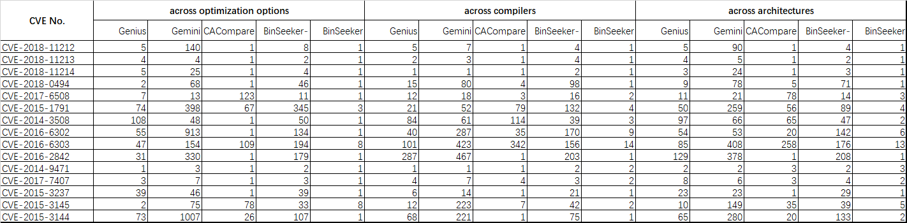

### Detailed experimental results for the paper `"Semantic Learning and Emulation Based Cross-platform Binary Vulnerability Seeker"`

`code` directory: the code implementation of BinSeeker
`dataset` directory: the dataset of BinSeeker
`result` directory: the detailed vulnerability search result

We list detailed search results as follows. For each vulnerability, the following figure shows the search ranking from three aspects: across compilation optimization options, across compilers and across architectures. 
We treat the vulnerable functions in the X86-GCC-O3 version of binaries as the source to search for them from the other versions of binaries (for example, X86-Clang-O0, MIPS-Clang-O3).

It is a supplement to the Section 4.2.1 on page 7 of the paper.
    

